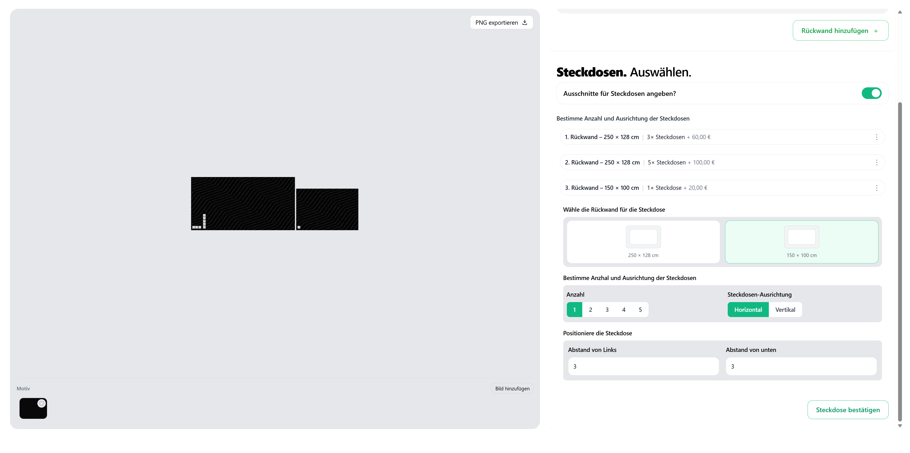
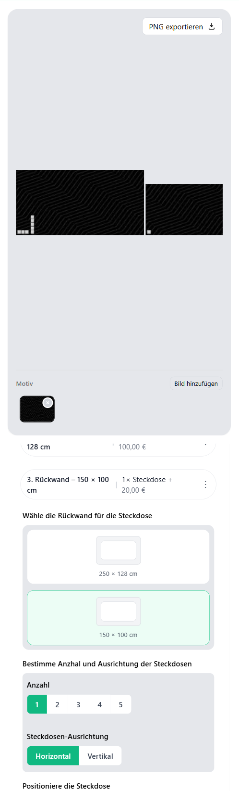
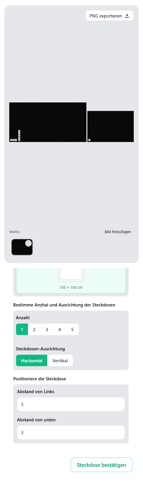

# ⚙️ Plate & Socket Generator System

A responsive and interactive **Plate & Socket Generator System** built with **React** and **Vite**.  
This tool allows users to **configure, visualize, and export custom wall plates**, now enhanced with **socket group creation and placement** for realistic layout simulation.

It dynamically manages plate resizing, scaling, and socket positioning — maintaining real-world proportions and visual accuracy — while being **highly performant and mobile-friendly**.

---

## 📖 Table of Contents

- [Overview](#overview)
- [Features](#features)
- [Visual & Canvas Behavior](#visual--canvas-behavior)
- [Plate Management](#plate-management)
- [Socket Management](#socket-management)
- [Validation & Feedback](#validation--feedback)
- [Bonus Features](#bonus-features)
- [Tech Stack](#tech-stack)
- [Installation & Setup](#installation--setup)
- [Usage](#usage)
- [Known Limitations & Assumptions](#known-limitations--assumptions)
- [Device Support](#device-support)
- [Screenshots / Demo](#screenshots--demo)
- [Author](#author)

---

<a name="overview"></a>

## 🧩 Overview

The **Plate & Socket Generator System** enables users to design **wall plate layouts** and **socket configurations** using accurate real-world scaling, live previews, and rule-based placement validation.

Each plate displays a segment of a shared **motif image**, while socket groups can be added, moved, and configured based on defined spatial constraints.  
All components scale dynamically and remain interactive across devices.

---

<a name="features"></a>

## 🧰 Features

### 🔹 1. Combined Plate & Socket Interface

- Interactive canvas preview with real-time updates.  
- Dynamic layout that scales proportionally to maintain true dimensions.  
- Automatic scaling so all plates fit horizontally within the canvas.  
- Mobile and touch-friendly — supports drag and input control.

### 🔹 2. Realistic Scaling

- Internal unit: **1 cm = 1 unit**.  
- The visual canvas auto-adjusts so that a **20x20 cm plate** and **40x40 cm plate** appear in a 1:2 ratio.  
- When multiple plates exist, they are **scaled down proportionally** to fit side-by-side.

---

<a name="visual--canvas-behavior"></a>

## 🖼️ Visual & Canvas Behavior

### Dual-Canvas Simulation

- Real-time rendering for both plates and sockets.  
- Canvas scales dynamically with window resize.  
- Supports touch interactions on mobile devices.  
- Proportions remain consistent regardless of resolution or zoom level.

### Guidelines During Socket Drag

- Live feedback lines from **left** and **bottom** plate edges to the socket group’s anchor point.  
- Display real-time distances (e.g., “23.4 cm”).  
- Prevents invalid placement visually and functionally.

---

<a name="plate-management"></a>

## 🧱 Plate Management

- Default plate generated on load with predefined dimensions.  
- Add or delete plates dynamically (minimum 1 must remain).  
- Supports width **20–300 cm**, height **30–128 cm**.  
- Configuration persists via **localStorage**.  
- Plates resize automatically to fit the canvas while preserving aspect ratio.  
- **Resizing a plate clears all its associated sockets.**

---

<a name="socket-management"></a>

## 🔌 Socket Management

### Socket Toggle

- Enable or disable the socket section globally.  
- When enabled, a default socket group is added to the first eligible plate.  
- When disabled, all socket groups are removed.

### Socket Rules

- Plates must be **at least 40×40 cm** to accept sockets.  
- If a plate is resized below the limit, its sockets are automatically removed.  
- Socket groups cannot be attached to invalid plates.

### Socket Group Configuration

Each socket group includes:

- **Plate Selector** – choose which valid plate it belongs to.  
- **Socket Count** – 1 to 5 sockets per group.  
- **Direction** – horizontal or vertical.  
- **Position Inputs** – distance from **left** and **bottom** in cm.  
- Anchor point = bottom-left of the **first socket**.

### Socket Dimensions & Constraints

- Each socket: **7×7 cm**  
- Gap between sockets: **0.2 cm**  
- Example: 3 horizontal sockets → **21.4 cm** total width  
- Minimum distances:
  - **3 cm** from plate edges  
  - **4 cm** from other socket groups  
- Sockets cannot overlap or exceed plate boundaries.  
- Socket groups cannot be dragged across plates.  

---

<a name="validation--feedback"></a>

## 🧩 Validation & Feedback

- Input clamping ensures valid ranges for dimensions and positions.  
- Invalid movements (e.g., overlap or out-of-bounds) are blocked immediately.  
- Clear visual feedback messages for blocked actions.  
- Socket positions remain at the **last valid position** if a drag is invalid.  
- Validation also applies to numeric input (no scientific notation).  

---

<a name="bonus-features"></a>

## ✅ Bonus Features

- Upload a **custom motif image** shared across all plates.  
- Export canvas as **PNG preview**.  
- Toggle units between **cm/inches** with automatic conversion.  
- Configuration persistence via **localStorage**.  
- Smooth real-time rendering and resizing.  
- Optimized performance even on low-end devices.  

---

<a name="tech-stack"></a>

## ⚙️ Tech Stack

- **React (18+)**  
- **Vite**  
- **Tailwind CSS**  
- **HTML5 Canvas API**  
- **Intl.NumberFormat** for locale-based input  
- **LocalStorage** for persistence  

---

<a name="installation--setup"></a>

## 🧭 Installation & Setup

### 1. Prerequisites

Ensure you have:

- [Node.js](https://nodejs.org/) (v16+)
- npm (bundled with Node) or yarn

### 2. Clone the repository

```bash
git clone https://github.com/Usama-ASattar/plate-generator-system.git
cd plate-generator-system
```

### 3. Install dependencies

```bash
npm install
# or
yarn install
```

### 4. Run the development server

```bash
npm run dev
```

Open in browser:
👉 [http://localhost:5173](http://localhost:5173)

### 5. Build for production

```bash
npm run build
```

### 6. Preview the production build

```bash
npm run preview
```

---

<a name="usage"></a>

## 🚀 Usage

- Launch the app — a default plate appears automatically.  
- Add or remove plates as needed.  
- Toggle **Sockets ON** to start adding socket groups.  
- Adjust socket count, direction, and placement.  
- Use drag or input fields to reposition sockets.  
- Resize plates to see dynamic canvas scaling.  
- Upload a custom image motif (optional).  
- Export your layout as a **PNG**.

---

<a name="known-limitations--assumptions"></a>

## ⚠️ Known Limitations & Assumptions
 
 
- PNG exports are **rasterized** (no vector support).  
- No drag-and-drop reordering of plates yet. 
- Assumes valid numeric input (no scientific notation).  

---

<a name="device-support"></a>

## 📱 Device Support

- Responsive (desktop, mobile).  
- Touch and drag interactions supported.  


---

<a name="screenshots--demo"></a>

## 📸 Screenshots / Demo

### 🖥️ Desktop View




### 📱 Mobile View





### 🎞️ Live Demo

👉 [Try it here](https://plate-generator-system-psi.vercel.app/)

---

<a name="author"></a>

## 🧑‍💻 Author

Developed by **Usama Abdul Sattar** — Frontend Engineer  
All rights reserved.
