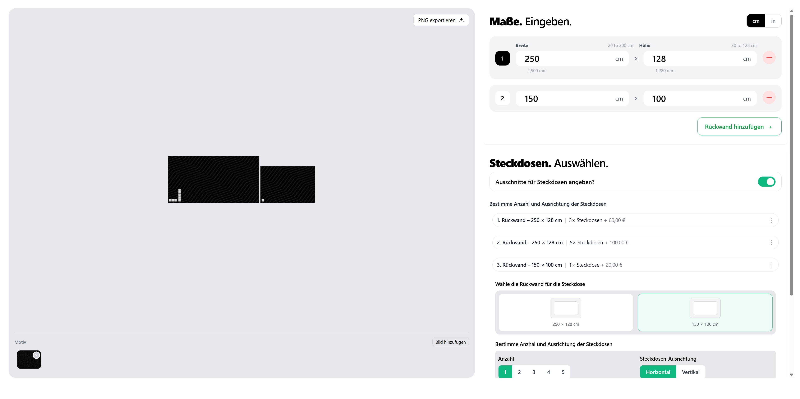
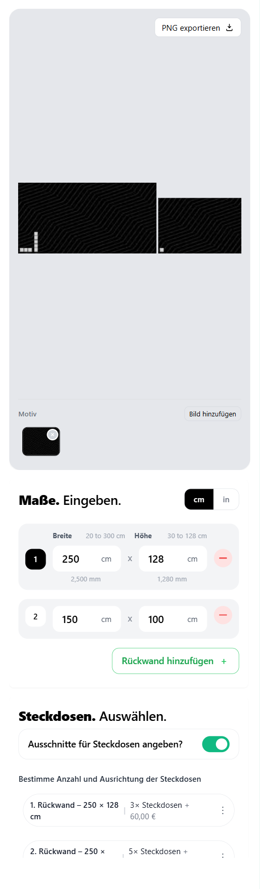

# 🧩 Plate Generator System

A responsive and interactive **Plate Generator System** built with React and Vite.  
This tool allows users to configure, visualize, and export custom wall plates, each representing a portion of a shared image motif.

It dynamically handles plate resizing, unit toggling (cm/in), and realistic scaling while remaining highly performant and mobile-friendly.

## 📖 Table of Contents

- [Overview](#overview)
- [Features](#features)
- [Visual & Canvas Behavior](#visual--canvas-behavior)
- [Bonus Features](#bonus-features)
- [Tech Stack](#tech-stack)
- [Installation & Setup](#installation--setup)
- [Usage](#usage)
- [Known Limitations & Assumptions](#known-limitations--assumptions)
- [Device Support](#device-support)
- [Screenshots / Demo](#screenshots--demo)
- [Author](#author)

<a name="overview"></a>

## 🧩 Overview

The Plate Generator System enables users to design wall plate layouts using accurate scaling and real-time image rendering.

Each plate displays a segment of a shared **motif image**, automatically updating when resized or added/removed.  
The app maintains a realistic preview with proportional scaling and persists configuration in localStorage.

<a name="features"></a>

## 🧰 Features

### 1. Plate Management

- Automatically creates one default plate on load.
- Configuration persists using **localStorage**.
- Add or remove plates dynamically (1–10 total).
- Each plate can have independent **width (20–300 cm)** and **height (30–128 cm)**.

### 2. Input Behavior & Validation

- Locale-aware input (supports both `.` and `,` as decimal separators).
- No hard HTML input limits — validation handled programmatically.
- Inline styled error messages for invalid values.
- Invalid values revert to the last valid state on blur.
- Unit toggle between **cm** and **inches**, with automatic conversion.

### 3. Responsive Layout

- Split view:
  - **Left:** Real-time canvas preview.
  - **Right:** Interactive plate controls.
- Fully mobile-optimized and touch-friendly.

<a name="visual--canvas-behavior"></a>

## 🖼️ Visual & Canvas Behavior

### Dual-Canvas Simulation

- The canvas automatically scales to maintain 1 cm = 1 px.
- Plates are displayed side-by-side, preserving real proportions.

### Image Rendering

- All plates share one continuous image (motif).
- Each plate displays only its corresponding section.
- If total width exceeds 300 cm, the image mirrors seamlessly.
- Centered cropping ensures proportional coverage.

### Realistic Scaling

- The canvas fits dynamically using `useFitScale`.
- Consistent rendering across resolutions and DPI levels.

<a name="bonus-features"></a>

## ✅ Bonus Features

- Upload a **custom image motif**
- Export preview as **PNG**
- Toggle between **cm/in**
- Persistent configuration via localStorage
- Smooth, real-time updates
- Optimized for low-end devices

<a name="tech-stack"></a>

## ⚙️ Tech Stack

- **React (18+)**
- **Vite**
- **Tailwind CSS**
- **HTML5 Canvas API**
- **Intl.NumberFormat** for locale formatting
- **LocalStorage API**

<a name="installation--setup"></a>

## 🧭 Installation & Setup

### 1. Prerequisites

Ensure you have the following installed:

- [Node.js](https://nodejs.org/) (v16 or newer)
- npm (comes with Node) or yarn

### 2. Clone the repository

```bash
git clone https://github.com/your-username/plate-generator.git
cd plate-generator
```

### 3. Install dependencies

```bash
npm install

If you prefer yarn:
yarn install
```

### 4. Run the development server

```bash
npm run dev


The app will be available at
👉 http://localhost:5173/
```

### 5. Build for production

```bash
npm run build
```

### 6. Preview production build

```bash
npm run preview
```

<a name="usage"></a>

## 🚀 Usage

- Start the app — a default plate appears automatically.

- Use “Rückwand hinzufügen” to add new plates (up to 10).

- Enter width and height for each plate (validated automatically).

- Toggle between cm and in to switch units.

- Watch the live preview update instantly.

- Upload a new image motif if desired.

- Export the configuration as a PNG preview.

<a name="known-limitations--assumptions"></a>

## ⚠️ Known Limitations & Assumptions

- Drag-and-drop reordering is not yet available.

- Uploaded motif does not persist across sessions.

- Exported PNG is rasterized (no vector format).

- Validation assumes numeric input only (no scientific notation).

- Optimized for modern browsers: Chrome, Edge, Safari, Firefox.

<a name="device-support"></a>

## 📱 Device Support

- Fully responsive (desktop, tablet, mobile)

- Touch interactions supported

- Canvas scaling optimized for high-DPI screens

<a name="screenshots--demo"></a>

## 📸 Screenshots / Demo

### 🖥️ Desktop View



### 📱 Mobile View



### 🎞️ Live Demo

If you have a deployed version:
👉 [Try it here](https://plate-generator-system-psi.vercel.app/)

<a name="author"></a>

## 🧑‍💻 Author

Developed by **Usama Abdul Sattar** (Frontend Engineer) — All rights reserved.
